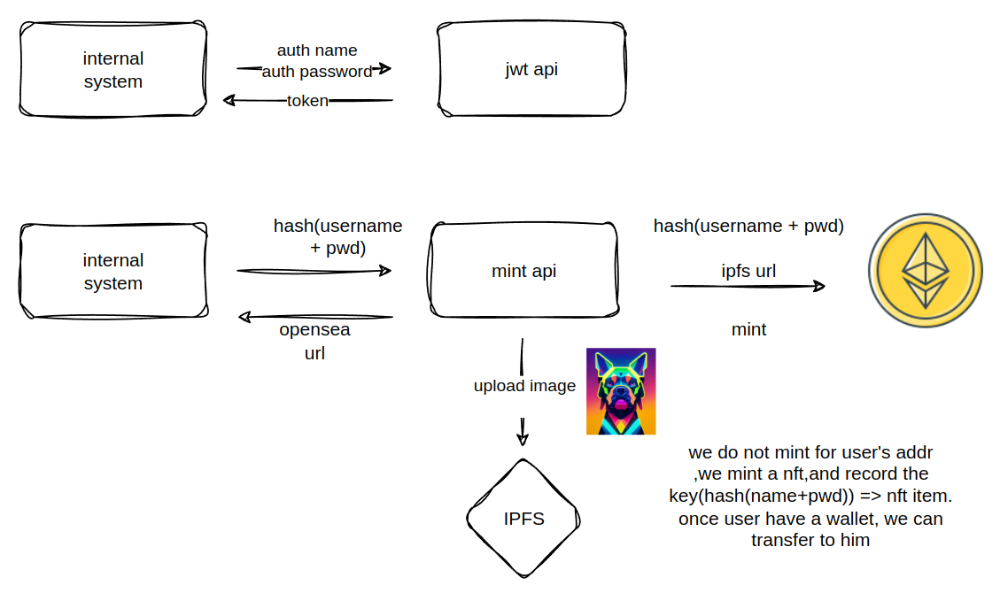
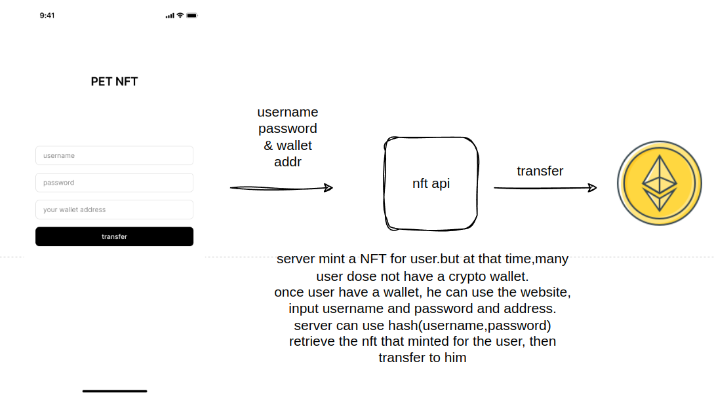

# **🚀PET NFT **


The goal of this project is to seamlessly integrate with Web2 systems, such as pet healthcare services or pet stores, and offer NFTs as gifts to offline users. Since many users may not initially have a crypto wallet, the system will mint an NFT for them in advance. Once they acquire a wallet, the NFT can be easily transferred to their ownership.
## **📂 Project Structure**

```
├── app
│   ├── api
│   │   ├── auth.py        # User authentication (login, JWT)
│   │   ├── nft.py         # NFT minting API logic
│   ├── models.py          # Database models (e.g., User)
│   └── __init__.py        # App initialization
├── config.py               # Configuration for environment variables
├── contracts               # Smart contract source code and tests
│   ├── src
│   │   └── nft_minter.sol  # Solidity contract for NFT minting
│   ├── scripts             # Deployment scripts for the contract
│   └── test                # Contract tests
├── manage.py               # Flask application entry point
├── requirements.txt        # Python dependencies
└── .gitignore              # Files and directories to ignore in Git
```

## **✨ Features**

- **Mint NFTs** 🖼️: Allows users to mint NFTs by uploading metadata to IPFS.
- **JWT Authentication** 🔑: User login and authentication via JWT.
- **Transfer NFTs** 💸: After minting, users can transfer the NFT to their wallet using their credentials.


## **🛠️ How It Works**
<div>
  
  
</div>

## **📦 Installation Instructions**

### **1. Clone the Repository**

```bash
git clone https://github.com/your-username/pet_nft.git
cd pet_nft
```

### **2. Set Up a Python Virtual Environment**

It's a good practice to isolate your dependencies using a virtual environment 🛠️.

```bash
python3 -m venv venv
source venv/bin/activate
```

### **3. Install Dependencies**

```bash
pip install -r requirements.txt
```

### **4. Configure Environment Variables**

You can set up environment variables directly or use a `.env` file. Below is an example of the required variables:

```ini
SECRET_KEY=your-secret-key
WEB3_PROVIDER=https://infura.io/v3/your-api-key
PRIVATE_KEY=your-eth-private-key
WALLET_ADDRESS=your-wallet-address
NFT_CONTRACT_ADDRESS=your-contract-address
IPFS_CONNECT_URL=https://ipfs.infura.io:5001
```

### **5. Initialize the Database**

Make sure to initialize your database (if you're using SQLite or any other DBMS) 🗂️:

```bash
flask db upgrade
```

### **6. Run the Application**

To start the Flask server 🚀:

```bash
python manage.py runserver
```

Your server will be running on `http://127.0.0.1:5000`.

## **🔧 API Usage**

### **1. Authentication (Login)**

To log in and receive an access token, send a `POST` request to `/login` with your credentials:

```bash
POST /login
Content-Type: application/json

{
  "username": "user",
  "password": "pass"
}
```

Response:

```json
{
  "access_token": "your-jwt-token"
}
```

### **2. Mint NFT**

After authentication, you can mint an NFT by uploading metadata and an image file 📤:

```bash
POST /nft/mint
Authorization: Bearer <access_token>
Content-Type: multipart/form-data

{
  "title": "My First NFT",
  "description": "This is a sample NFT",
  "file": <image_file>,
  "uid": "unique_id_for_user"
}
```

The response will include the OpenSea URL 🌍 :

```json
{
  "metadata_url": "https://testnets.opensea.io/assets/rinkeby/<contract-address>/<token-id>",
  "status": 0
}
```

### **3. Transfer NFT**

To transfer the NFT to the user's wallet, send the transaction request 📲:

```bash
POST /nft/transfer
Authorization: Bearer <access_token>
Content-Type: application/json

{
  "recipient_wallet": "0xRecipientWalletAddress",
  "username": "username",
  "password": "pwd"
}
```

## **🤝 Contributing**

Contributions are welcome! 🎉 Feel free to open a pull request or an issue for any bugs, feature requests, or suggestions. Let’s make this project better together 💪!

## **📜 License**

This project is licensed under the MIT License 📄. See the `LICENSE` file for more details.
